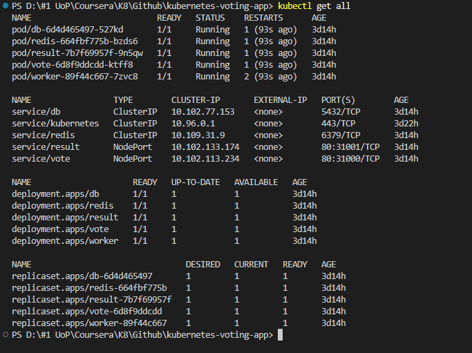
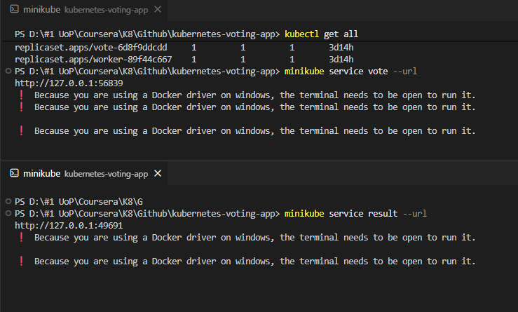
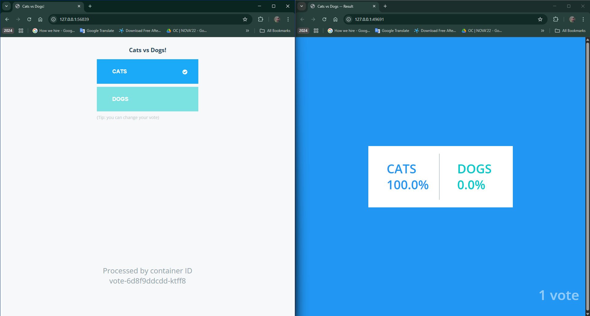

# Voting App Kubernetes Deployment

## Project Overview

This project demonstrates how to deploy a microservices-based voting application on Kubernetes. The application consists of five components:

* **vote:** Front-end (Python/Flask) for users to cast votes.
* **result:** Front-end (Node.js) for viewing real-time results.
* **worker:** Background processor (.NET) that moves votes from Redis to the DB.
* **redis:** In-memory queue for collecting raw votes.
* **db:** PostgreSQL database for storing tallied votes.

---

## Folder Structure

Ensure your project directory looks like this:

```text
voting-app-deployments/
├─ db-deployment.yaml
├─ db-service.yaml
├─ redis-deployment.yaml
├─ redis-service.yaml
├─ result-deployment.yaml
├─ result-service.yaml
├─ vote-deployment.yaml
├─ vote-service.yaml
├─ worker-deployment.yaml
```

---

## Part 1: Kubernetes Manifests (YAML Code)

Copy the code blocks into their respective files.

---

## Part 2: Deployment Instructions

### Step 1: Local Deployment with Minikube

1.  **Start Minikube:**
    ```bash
    minikube start
    ```

2.  **Apply all YAML files:**
    ```bash
    kubectl apply -f .
    ```

3.  **Check the status:**
    ```bash
    kubectl get all
    ```

4.  **Access the application:**
    ```bash
    minikube service vote --url
    minikube service result --url
    ```
    *Open the URLs in your browser.*

### Step 2: Cloud Deployment (GKE / EKS / AKS)

1.  **Push your YAML files to GitHub.**
2.  **Connect to your cloud cluster** (using `gcloud`, `aws`, or `az` CLI).
3.  **Deploy:**
    ```bash
    kubectl apply -f .
    ```
4.  **Access:**
    * If using **NodePort**, find the Node IP and port.
    * (Optional) Edit `vote-service.yaml` to change `type: NodePort` to `type: LoadBalancer` to get a public External IP.

---

## Step 3: Architecture Flow

```text
          +-----------+        +--------+
          |   Vote    | ---->  | Worker |
          +-----------+        +--------+
                 |                  |
                 v                  v
           +------------+     +-----------+
           |   Result   |     |   Redis   |
           +------------+     +-----------+
                 ^
                 |
           +------------+
           |     DB     |
           +------------+
```

1.  **Vote** sends input to **Worker**.
2.  **Worker** processes data from **Redis** and updates **DB**.
3.  **Result** reads from **DB** to display stats.

---

## Step 4: Verification & Experiments

**Scaling:**
```bash
kubectl scale deployment vote --replicas=3
kubectl scale deployment worker --replicas=2
```

**Debugging:**
```bash
# Check logs
kubectl logs <pod-name>

# Enter a pod
kubectl exec -it <pod-name> -- /bin/bash
```

---

## 📸 Architecture & UI Screenshots

<p align="center">
  <br>
  <b>All Components</b>
</p>

<p align="center">
  <br>
  <b>Frontend URLs</b>
</p>


<p align="center">
  <br>
  <b>Frontend Architecture</b>
</p>


## References
* [Kubernetes Official Docs](https://kubernetes.io/docs/home/)
* [Kubernetes for the Absolute Beginners with Hands-on Labs Course](https://www.coursera.org/learn/kubernetes-for-absolute-beginners/home/welcome)
